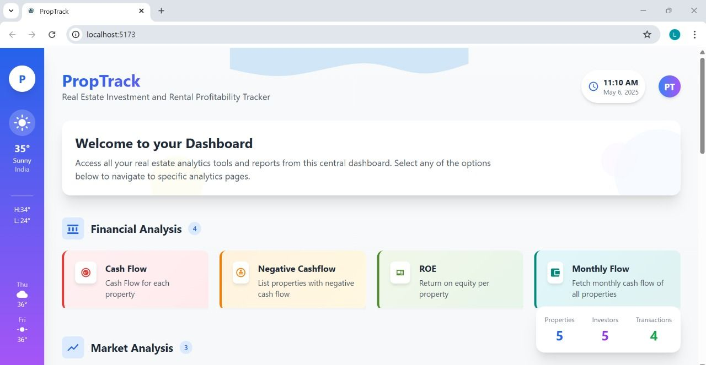
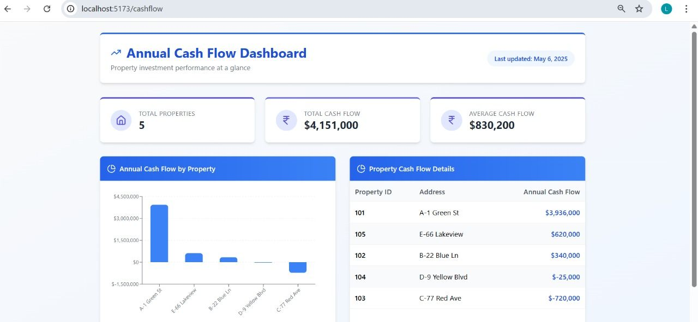
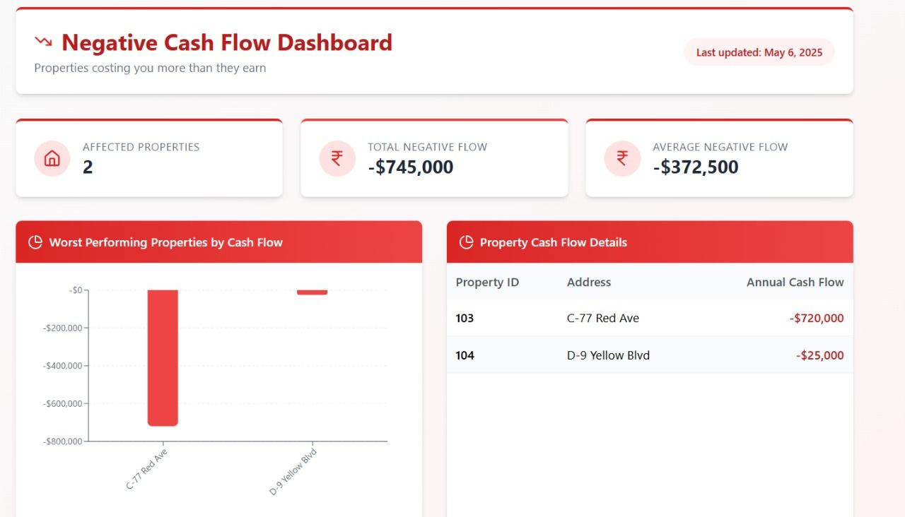
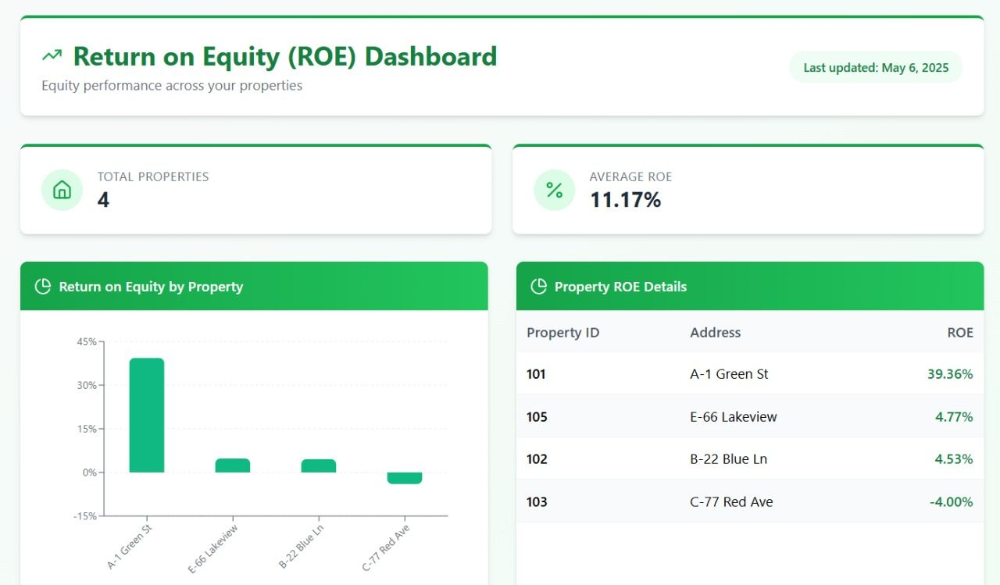
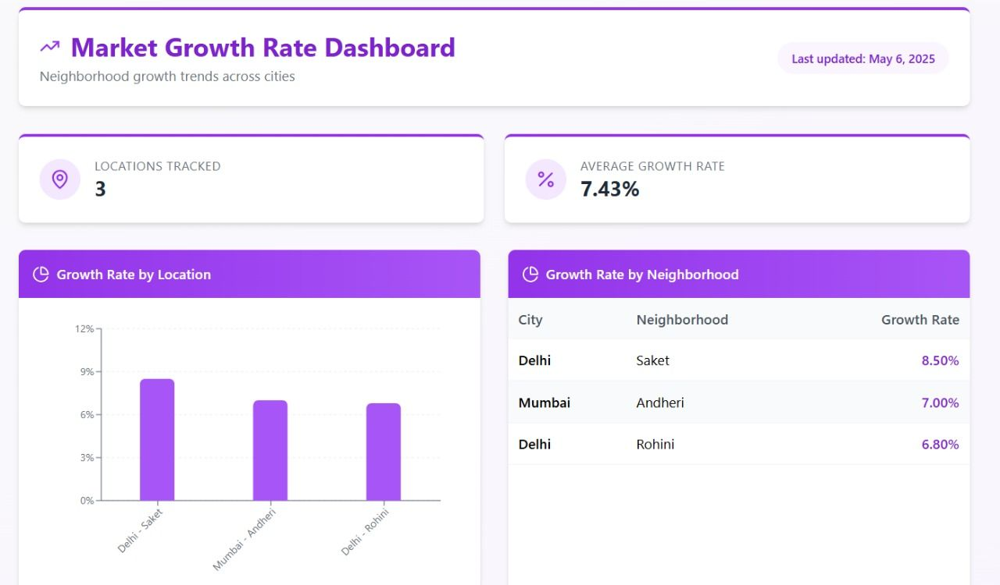
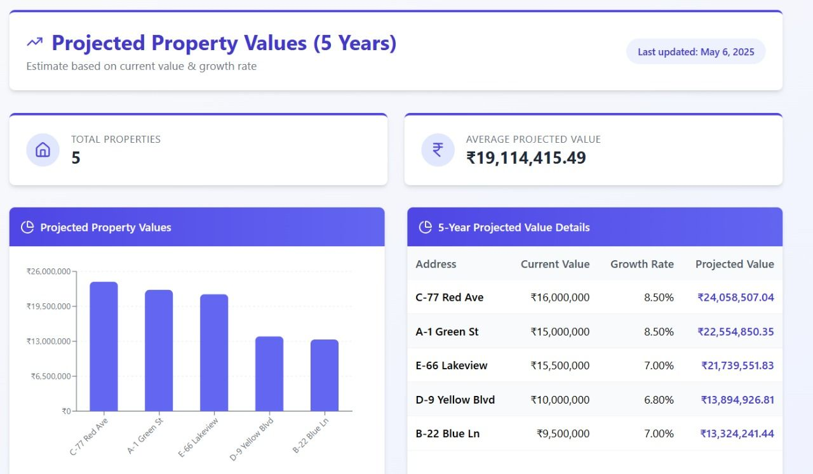
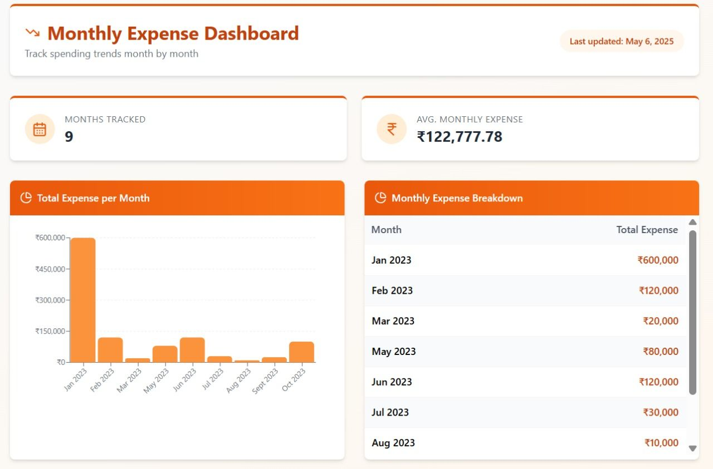
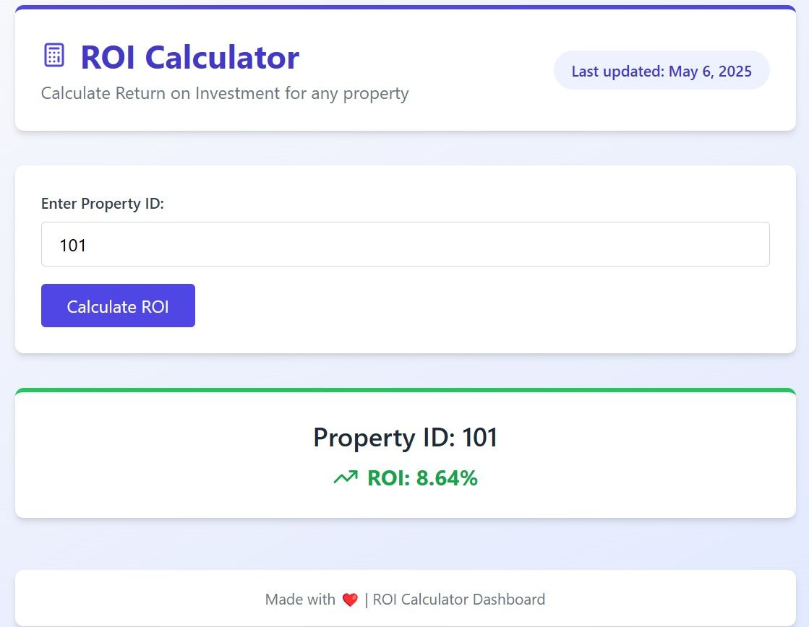
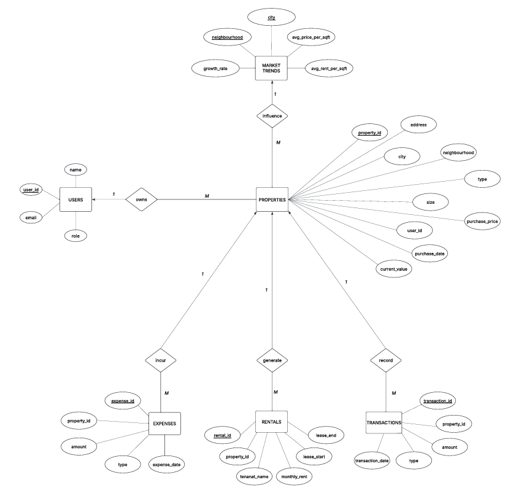

# Real Estate Investment & Rental Profitability Tracker



A full-stack real estate analytics platform built with **Django REST, Oracle DB, raw SQL, PL/SQL, and React** to analyze rental profitability, property cash flow, ROI, market trends, lease exposure, and financial anomalies.

The backend is intentionally **database-first**: all analytics are powered by manually written SQL/PLSQL queries instead of ORM-based abstractions.

---

## Overview

Real estate investors often track rent, expenses, transactions, lease dates, and property appreciation through spreadsheets. As the portfolio grows, this becomes difficult to maintain and harder to analyze.

This platform centralizes property data and converts it into investor-focused dashboards using raw SQL and PL/SQL.

It helps answer:

- Which properties generate the highest cash flow?
- Which properties are running at a loss?
- What is the ROI/ROE of each property?
- Which neighborhoods are growing fastest?
- Which assets are undervalued compared to market trends?
- Which properties have abnormal prices, high expenses, or no rental income?

---

## Tech Stack

| Layer | Technology |
|---|---|
| Frontend | React.js |
| Backend | Django REST Framework |
| Database | Oracle Database |
| Query Layer | Raw SQL + PL/SQL |
| API Style | REST APIs |
| Visualization | React dashboards and charts |

---

## Key Highlights

- Designed a normalized relational schema with strict **primary key / foreign key** relationships.
- Implemented analytics using **raw SQL and PL/SQL** instead of ORM.
- Built **17+ SQL/PLSQL query modules** for investment analysis.
- Used joins, aggregations, subqueries, ranking, date operations, statistical filtering, and financial calculations.
- Added PL/SQL-based ROI calculation and lease countdown logic.
- Integrated Django REST APIs with a React dashboard for query-driven visual analytics.
- Covered financial analysis, market analysis, rental management, investor insights, and anomaly detection.

---

## Dashboard Preview

### Main Dashboard


### Financial Analysis







### Market Analysis





### Expense and ROI Analytics





---

## Core Features

| Module | Feature | Purpose |
|---|---|---|
| Financial Analysis | Annual Cash Flow | Calculates yearly profit/loss per property |
| Financial Analysis | Negative Cash Flow | Detects properties costing more than they earn |
| Financial Analysis | Monthly Cash Flow | Tracks recurring monthly rent-expense performance |
| Financial Analysis | Return on Equity | Measures return against current property value |
| Financial Analysis | ROI Calculator | Calculates ROI using a PL/SQL stored procedure |
| Market Analysis | Market Growth | Ranks neighborhoods by growth rate |
| Market Analysis | Projected Value | Estimates 5-year future property value |
| Market Analysis | Undervalued Properties | Finds properties below market price per sqft |
| Rental Management | Active Leases | Lists currently active rental agreements |
| Rental Management | Lease Countdown | Calculates days left until lease expiry |
| Rental Management | Above Market Rent | Finds tenants paying above estimated market rent |
| Investor Insights | Top Investors | Ranks investors by number of properties owned |
| Investor Insights | Average Expense | Computes average expense per owner |
| Expense Insights | Monthly Expense | Tracks expense patterns by month |
| Expense Insights | Top Expense Months | Finds highest expense months per property |
| Anomaly Detection | Price Outliers | Detects abnormal purchase transactions |
| Anomaly Detection | No Rental, High Expense | Flags properties with expenses but no rental income |

---

## Database Design

The system is built around six core entities.

| Entity | Purpose |
|---|---|
| Users | Stores investor/user information |
| Properties | Stores property details, location, size, purchase price, and current value |
| Rentals | Stores tenant, rent, lease start, and lease end details |
| Expenses | Stores maintenance, tax, and operational expenses |
| Transactions | Stores purchase/sale transaction history |
| Market Trends | Stores city/neighborhood-level price, rent, and growth data |

---

## ER Diagram



### Main Relationships

| Relationship | Cardinality | Meaning |
|---|---|---|
| Users → Properties | 1:M | One user can own multiple properties |
| Properties → Rentals | 1:M | One property can have multiple rental records |
| Properties → Expenses | 1:M | One property can incur multiple expenses |
| Properties → Transactions | 1:M | One property can have multiple transactions |
| Market Trends → Properties | 1:M | One market area can influence multiple properties |

---

## Query Modules

All analytics are implemented through raw SQL/PLSQL files inside the `queries/` directory.

```txt
queries/
├── above_market.sql
├── active_leases.sql
├── average_expense.sql
├── calculate_roi_pls.sql
├── cashflow.sql
├── cashflow_monthly.sql
├── days_to_end_pls.sql
├── growth.sql
├── monthly_expense.sql
├── negative_cashflow.sql
├── no_rental_high_expense.sql
├── outliers.sql
├── projection.sql
├── roe.sql
├── show_expenses.sql
├── show_market_trends.sql
├── show_properties.sql
├── show_rentals.sql
├── show_transactions.sql
├── show_users.sql
├── top_investors.sql
├── top_months.sql
└── undervalued.sql
```

---

## Representative SQL/PLSQL Queries

### Annual Cash Flow

Calculates yearly cash flow by subtracting total annual expenses from annual rental income.

```sql
SELECT
    p.property_id,
    p.address,
    COALESCE(r.total_rent, 0) - COALESCE(e.total_expense, 0) AS annual_cash_flow
FROM Properties p
LEFT JOIN (
    SELECT property_id, SUM(monthly_rent * 12) AS total_rent
    FROM Rentals
    GROUP BY property_id
) r ON p.property_id = r.property_id
LEFT JOIN (
    SELECT property_id, SUM(amount) AS total_expense
    FROM Expenses
    GROUP BY property_id
) e ON p.property_id = e.property_id;
```

---

### Negative Cash Flow Detection

Finds properties where annual expenses exceed annual rent.

```sql
SELECT
    p.property_id,
    p.address,
    COALESCE(r.total_rent, 0) - COALESCE(e.total_expense, 0) AS annual_cash_flow
FROM Properties p
LEFT JOIN (
    SELECT property_id, SUM(monthly_rent * 12) AS total_rent
    FROM Rentals
    GROUP BY property_id
) r ON p.property_id = r.property_id
LEFT JOIN (
    SELECT property_id, SUM(amount) AS total_expense
    FROM Expenses
    GROUP BY property_id
) e ON p.property_id = e.property_id
WHERE COALESCE(r.total_rent, 0) - COALESCE(e.total_expense, 0) < 0;
```

---

### Return on Equity

Measures annual return relative to current property value.

```sql
SELECT
    p.property_id,
    p.address,
    ROUND(((COALESCE(r.total_rent, 0) * 12 - COALESCE(e.total_expense, 0)) / 
           NULLIF(p.current_value, 0)) * 100, 2) AS ROE
FROM Properties p
LEFT JOIN (
    SELECT property_id, SUM(monthly_rent) AS total_rent
    FROM Rentals
    GROUP BY property_id
) r ON p.property_id = r.property_id
LEFT JOIN (
    SELECT property_id, SUM(amount) AS total_expense
    FROM Expenses
    GROUP BY property_id
) e ON p.property_id = e.property_id;
```

---

### ROI Calculation Using PL/SQL

Calculates property ROI using a stored procedure.

```sql
CREATE OR REPLACE PROCEDURE calculate_property_roi (
    p_id IN PROPERTIES.property_id%TYPE,
    roi OUT NUMBER
) IS
    rent NUMBER;
    expense NUMBER;
    price NUMBER;
BEGIN
    SELECT NVL(SUM(monthly_rent), 0) * 12 
    INTO rent 
    FROM Rentals 
    WHERE property_id = p_id;

    SELECT NVL(SUM(amount), 0) 
    INTO expense 
    FROM Expenses 
    WHERE property_id = p_id;

    SELECT purchase_price 
    INTO price 
    FROM Properties 
    WHERE property_id = p_id;

    roi := ROUND(((rent - expense) / price) * 100, 2);
END
```

---

### Lease Countdown Using PL/SQL

Calculates the number of days left before a lease ends.

```sql
CREATE OR REPLACE FUNCTION days_to_lease_end(r_id IN RENTALS.rental_id%TYPE)
RETURN NUMBER
IS
    end_date DATE;
BEGIN
    SELECT lease_end 
    INTO end_date 
    FROM Rentals 
    WHERE rental_id = r_id;

    RETURN GREATEST(end_date - SYSDATE, 0);
END
```

---

### 5-Year Property Value Projection

Projects future property value using neighborhood growth rate.

```sql
SELECT
    p.address,
    p.current_value,
    mt.growth_rate,
    ROUND(p.current_value * POWER(1 + mt.growth_rate / 100.0, 5), 2) AS projected_value_in_5_years
FROM Properties p
JOIN Market_Trends mt 
    ON p.city = mt.city 
   AND p.neighbourhood = mt.neighbourhood;
```

---

### Undervalued Properties

Finds properties priced below the average market price per square foot.

```sql
SELECT
    p.property_id,
    p.address,
    p.city,
    p.neighbourhood,
    (p.purchase_price / p.property_size) AS actual_price_per_sqft,
    mt.avg_price_per_sqft,
    mt.avg_price_per_sqft - (p.purchase_price / p.property_size) AS delta
FROM Properties p
JOIN Market_Trends mt 
    ON p.city = mt.city 
   AND p.neighbourhood = mt.neighbourhood
WHERE (p.purchase_price / p.property_size) < mt.avg_price_per_sqft
ORDER BY delta DESC;
```

---

### Price Outlier Detection

Detects unusually high purchase transactions using average and standard deviation.

```sql
SELECT 
    p.address, 
    t.amount AS purchase_price
FROM Properties p
JOIN Transactions t ON p.property_id = t.property_id
WHERE t.type = 'purchase'
  AND t.amount > (
    SELECT AVG(amount) + 2 * STDDEV(amount)
    FROM Transactions
    WHERE type = 'purchase'
  );
```

---

## Backend Architecture

```txt
React Frontend
      |
      v
Django REST APIs
      |
      v
Raw SQL / PL-SQL Query Files
      |
      v
Oracle Database
```

The backend uses Django REST Framework for API routing and response handling, while the business logic is executed through raw SQL and PL/SQL query files.

This keeps the database layer transparent and makes the SQL logic directly visible in the backend.

---

## API Mapping

| Endpoint Purpose | Query File |
|---|---|
| Annual Cash Flow | `cashflow.sql` |
| Monthly Cash Flow | `cashflow_monthly.sql` |
| Negative Cash Flow | `negative_cashflow.sql` |
| Return on Equity | `roe.sql` |
| ROI Calculator | `calculate_roi_pls.sql` |
| Lease Countdown | `days_to_end_pls.sql` |
| Active Leases | `active_leases.sql` |
| Above Market Rent | `above_market.sql` |
| Market Growth | `growth.sql` |
| Projected Value | `projection.sql` |
| Undervalued Properties | `undervalued.sql` |
| Monthly Expenses | `monthly_expense.sql` |
| Top Expense Months | `top_months.sql` |
| Top Investors | `top_investors.sql` |
| Average Expense | `average_expense.sql` |
| Price Outliers | `outliers.sql` |
| No Rental, High Expense | `no_rental_high_expense.sql` |
| Show Users | `show_users.sql` |
| Show Properties | `show_properties.sql` |
| Show Rentals | `show_rentals.sql` |
| Show Expenses | `show_expenses.sql` |
| Show Transactions | `show_transactions.sql` |
| Show Market Trends | `show_market_trends.sql` |

---

## Sample API Response

```json
[
  {
    "property_id": 101,
    "address": "A-1 Green St",
    "annual_cash_flow": 3936000
  },
  {
    "property_id": 105,
    "address": "E-66 Lakeview",
    "annual_cash_flow": 620000
  },
  {
    "property_id": 103,
    "address": "C-77 Red Ave",
    "annual_cash_flow": -720000
  }
]
```

---

## Why Raw SQL?

The analytics layer was built using raw SQL and PL/SQL instead of ORM because the goal was to keep full control over:

- Join logic
- Aggregation logic
- Financial calculations
- PL/SQL procedures and functions
- Query optimization
- Database-side business rules
- Backend-to-database integration

This makes the project stronger from a backend/database engineering perspective because the actual SQL logic is visible, testable, and directly mapped to dashboard features.

---

## Local Setup

### Clone the Repository

```bash
git clone https://github.com/your-username/Real-Estate-Investment-and-Rental-Profitability-Tracker.git
cd Real-Estate-Investment-and-Rental-Profitability-Tracker
```

### Backend Setup

```bash
cd backend
python -m venv venv
venv\Scripts\activate
pip install -r requirements.txt
python manage.py runserver
```

Create a `.env` file for Oracle database credentials:

```env
DB_USER=your_oracle_username
DB_PASSWORD=your_oracle_password
DB_HOST=localhost
DB_PORT=1521
DB_SERVICE=XE
```

### Frontend Setup

```bash
cd frontend
npm install
npm run dev
```

Frontend runs at:

```txt
http://localhost:5173
```